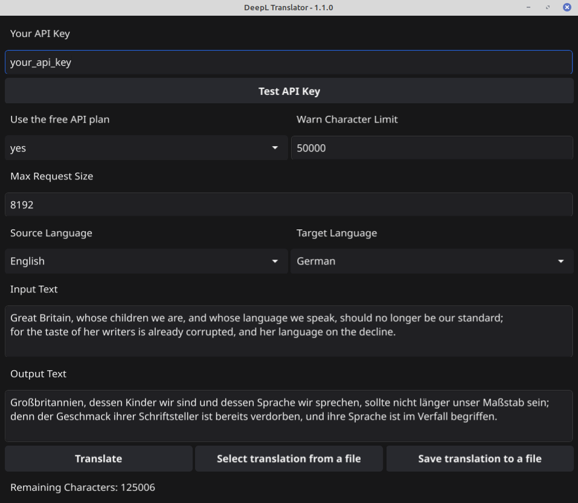

# DeepL Translator

This application translates text using the free or paid plan of DeepL API.

## CLI


## GUI



The main reason I created this app is because I wanted to translate a couple of subtitle files painlessly from the command line. 

Since DeepL makes a much better/natural translation than Google Translate and offers a free tier with a monthly limit of 500000 characters (which is more than enough for a couple of translations I need, but of course, if you use a paid package on DeepL, and increased character limit will apply) - I decided to use it's Translator API.

It's also handy for fast and small string translations when I don't want to use Google Translate.

Supports only textual (`.txt`) files or string inputs!

## Features

- Translate text from an input file or a provided string.
- Output translated text to a file or the screen.
- Displays the remaining character limit for the DeepL API key.
- Supports both free and paid DeepL API endpoints.
- Configurable maximum request size and character limit warnings.

## Requirements

- Go v1.23
- A DeepL API key (free or paid)

## Build

`go build -x -o translator`

## Configuration

The program uses a `settings.json` file for basic configuration. You could set some configuration items directly here in order to avoid specifying them as flags in the CLI.

The `api_key`, the `source_lang` and the `target_lang` parameters will be overwritten if they're specified as flags in the command line.

```json
{
    "api_key": "your_api_key",
    "free_api": "yes",
    "source_lang": "EN",
    "target_lang": "DE",
    "warn_character_limit": 50000,
    "max_request_size": 8192
}
```
### api_key

Your DeepL API key. Once you register on DeepL, you could find or create a key on https://www.deepl.com/en/your-account/keys

### source_lang 

The source language code (e.g. `"EN"` for English). Find all the supported languages on https://developers.deepl.com/docs/resources/supported-languages

### target_lang

The same as for `source_lang`

### warn_character_limit

Set the character limit of the input file or string at which a warning will be issued in order to avoid too huge translation requests by accident (default is 50.000).

### max_request_size

The maximum size of each request to the DeepL API. In case you get a `413 Request Entity Too Large` error, decrease this number, and the request will be sent in even smaller chunks to the API.

## Help

`translator --help` or `translator -h`

## Usage

```
translator -gui -api_key <key> -free_api <true|false> -input_string <text> -input_file <path> -output_file <path> -source_lang <lang_code> -target_lang <lang_code> -output <file|screen>
```

### gui

Optional. If you add the `-gui` flag, it will start the GUI version of the application.

### api_key

DeepL API key. Optional if provided in `settings.json`.

### free_api

Use the free API endpoint (`yes` or `no`, default: `yes`).

### input_string

Text to be translated. Make sure your special characters are escaped.

### input_file

Path to the input file containing the text to be translated. In case `input_string` is defined, it will override the `input_file`.

### output_file

Path to the output file where the translated text will be saved. 

In case it's not provided, the filename will be generated from the first 10 characters of the `input_string`, and in case an `input_file` is specified, the translated file will be saved as `input_file.translates.txt`.

### source_lang

Source language code. Optional if provided in `settings.json`.

### target_lang

Target language code. Optional if provided in `settings.json`.

### output

Output destination (`file` or `screen`, default: `file`).

## Examples

API key, source language and target language **not** specified in `config.json`, outputs the text on the screen:

```
translator -input_string "Hello, world!" -api_key "your_api_key" -source_lang "EN" -target_lang "DE" -output "screen"
```

API key, source language and target language **specified** in `config.json`. This will create a `Hello__wor.txt` with the translated text.

```
translator -input_string "Hello, world!" -output "file"
```

API key, source language and target language **specified** in `config.json`. Specified input and output file. This will create a `translated_example.txt` with the translated text.

```
translator -input_file "example.txt" -output_file "translated_example.txt"_
```

API key, source language and target language **not** specified in `config.json`. This will create a `translated_example.txt` with the translated text.

```
translator -input_file "example.txt" -output_file "translated_example.txt" -api_key "your_api_key" -source_lang "EN" -target_lang "DE"
```

The `-output "screen"` flag will override the `-output_file` flag, so in case you issue this command:

```
translator -input_file "example.txt" -output_file "translated_example.txt" -api_key "your_api_key" -source_lang "EN" -target_lang "DE" -output "screen"
```

It will only output the translated text to the screen and won't create a translation file. So in this case, it's not necessary to use the `-output_file` flag.

## History

### v1.0.0

- Initial release

### v1.1.0

- Added GUI support

## License

This project is licensed under the MIT License.